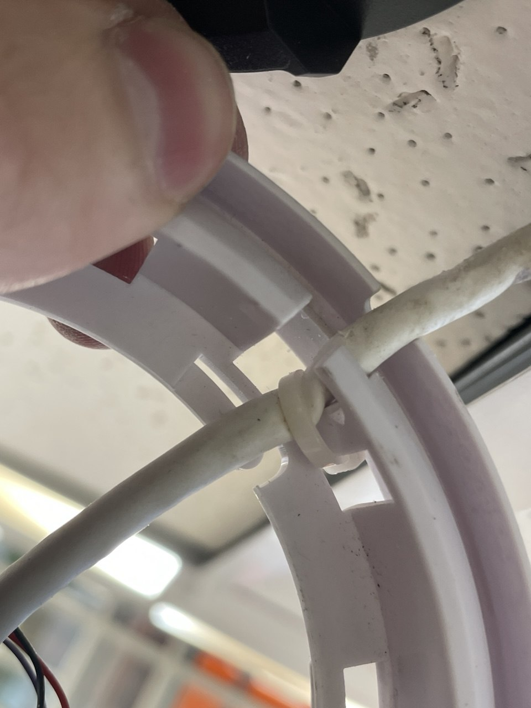
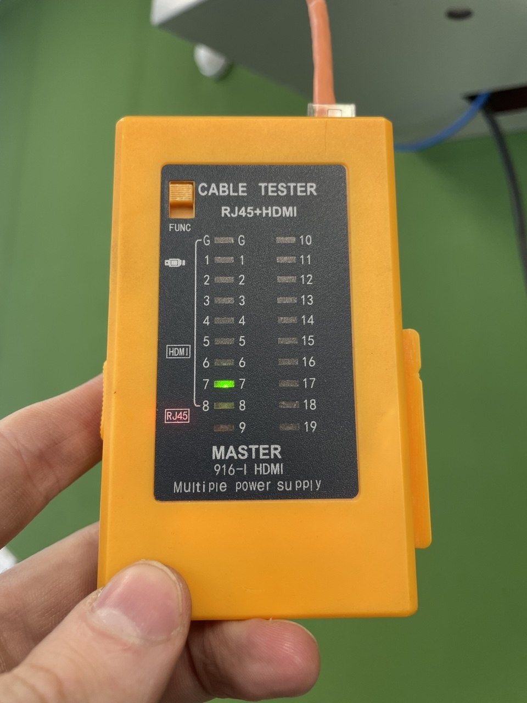
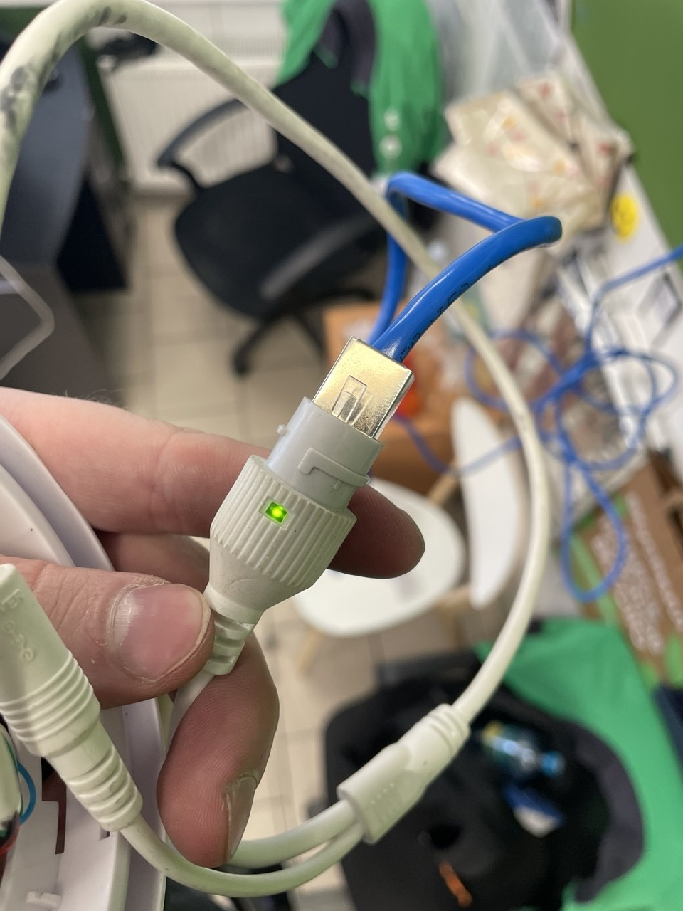
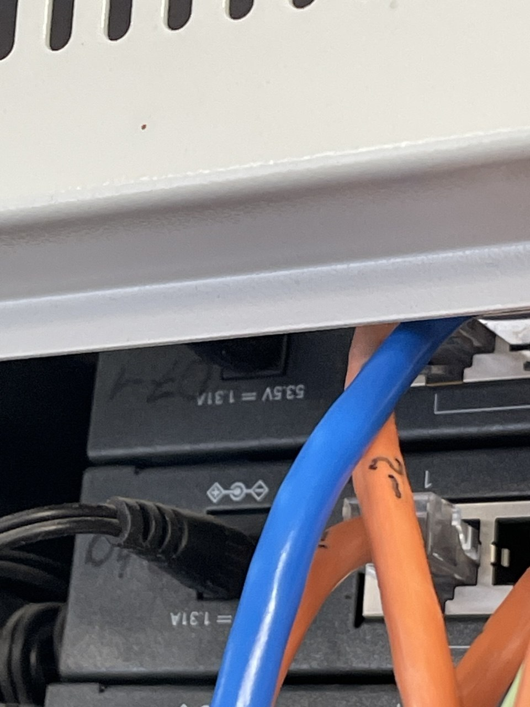

# Edge CCTV Infrastructure Recovery: Physical Layer Fault Isolation & Topology Remediation

A production post-mortem, incident resolution log, and automated verification suite addressing an edge IP camera outage caused by cable mechanical compression (over-tensioned zip-tie), core breakage, and subsequent PoE controller degradation.

## Overview & Business Context

### The Challenge
A critical edge surveillance camera went offline (`DOWN`). Remote management operations—including software restarts and remote PoE power-cycling via the managed switch—failed to bring the link back up.

### The Business Impact
Loss of perimeter surveillance posed an operational vulnerability and compliance risk. Rapid triage and physical-layer recovery were required to restore streaming services without unnecessary hardware replacement.

## Diagnostic Evidence & Architecture

```text
[ PoE Switch (53.5V PSE) ]
      │
      ├─ [ Port 1 (Blown Controller) ] ──x (Short-circuit event)
      │
      └─ [ Port 2 (Active PoE 802.3af) ]
            │
            └── [ Cat5e/6 UTP 23AWG (T-568B) ] ──► [ IP Camera (Direct Link) ]
                                                          │ (RTSP Stream)
                                                          ▼
                                                [ Surveillance Platform ]
```

### Physical Layer Inspection

| Defect Identification | Hardware Continuity Verification |
| :---: | :---: |
|  |  |
| *Root Cause: High mechanical strain and sheath puncture caused by over-torqued cable tie* | *L1 Verification: Sequential 1-8 pin pass confirmed on rebuilt termination* |

| Benchtop Direct PoE Verification | Switch Port Reallocation |
| :---: | :---: |
|  |  |
| *Direct bench test: PoE delivery confirmed via active link/power LED indicator* | *Port migration: Cable reallocated from dead Port 1 to operational Port 2* |

## Root Cause Analysis (RCA)

Investigation isolated three distinct issues masking the true point of failure:

1. **Mechanical Stress & Core Severance (Primary Root Cause):** 
   During original installation, a nylon zip-tie was over-tensioned across the internal mounting bracket. Over time, thermal cycles and static strain cut through the outer jacket, pinching internal conductors. This caused an open fault on Core 8 (Brown) and an intermittent internal short circuit across PoE delivery conductors.
2. **Switch Port PoE Controller Lockout:** 
   The line short-circuit caused a hardware failure on Switch Port 1's PSE controller. While adjacent switch ports operated normally, Port 1 permanently failed to negotiate 802.3af handshakes.
3. **Tooling Anomaly:** 
   Mid-triage mechanical failure of the initial crimping tool introduced uneven pin seating depths, producing transient open circuits before a calibrated replacement crimper was deployed.

## Remediation Workflow

### 1. Isolated Benchtop Diagnostics
* Dismounted edge unit and established a direct patch connection straight into the switch rack.
* Verified sensor integrity and system firmware, eliminating device-level failure.

### 2. Physical Layer Reconstruction
* Cleared damaged cable segments.
* Re-terminated lines to the **ANSI/TIA-568-B** standard using verified pure copper conductors:
  ```text
  Pin 1: White-Orange  | Pin 5: White-Blue
  Pin 2: Orange        | Pin 6: Green
  Pin 3: White-Green   | Pin 7: White-Brown
  Pin 4: Blue          | Pin 8: Brown
  ```
* Verified full 8-pin continuity with hardware sequential master/remote testing.

### 3. Port Migration & Commissioning
* Migrated connection from defective Port 1 to verified PoE Port 2.
* Confirmed PoE link negotiation via LED feedback and IP network discovery.
* Re-installed edge unit with service loops and calibrated, finger-tight cable management to prevent localized strain.

## Automated Verification Suite

A diagnostic script (`monitor_camera.sh`) is provided to validate the operational status across L3, SNMP PoE state, and L7 media streaming.

```bash
# Export runtime variables
export CAMERA_IP="192.168.1.120"
export RTSP_USER="cctv_admin"
export RTSP_PASSWORD="EncryptedSecretHere"
export RTSP_PATH="/live/ch0"
export SWITCH_IP="192.168.1.2"
export PORT_INDEX="2"

# Execute suite
./monitor_camera.sh
```

### Expected Output
```text
=== [1/3] Checking ICMP Reachability ===
[OK] Host 192.168.1.120 is reachable via ICMP.
=== [2/3] Checking Port State via SNMP (dot3afPethPsePortDetectionStatus) ===
PoE Port 2 Status OID response: deliveringPower
[OK] Switch is delivering power over PoE on port 2.
=== [3/3] Validating RTSP Media Feed ===
[OK] RTSP video stream received and parsed successfully.
=== [RESULT] All health checks passed. System is nominal. ===
```

## Key Lessons Learned

* **Cable Management Discipline:** Zip-ties should never be over-torqued on structural runs. Hook-and-loop (Velcro) straps or loose-loop zip-ties prevent mechanical core severance.
* **Isolate Variables Systematically:** Benchtop direct connection ("testing on the knee") saved hours by verifying camera hardware health independently from structured cabling.
* **Component-Level Switch Port Vulnerability:** A short circuit on an edge link can destroy an individual switch port's PoE delivery chip while data switching and neighbor ports continue functioning normally.
## License
Copyright (c) 2026 zazauzr. All rights reserved.
This repository and all its contents (including documentation, scripts, and configuration files) are proprietary and confidential. 
Unauthorized copying, distribution, modification, public display, or commercial use of any materials from this repository, via any medium, is strictly prohibited without the express prior written permission of the copyright holder.
